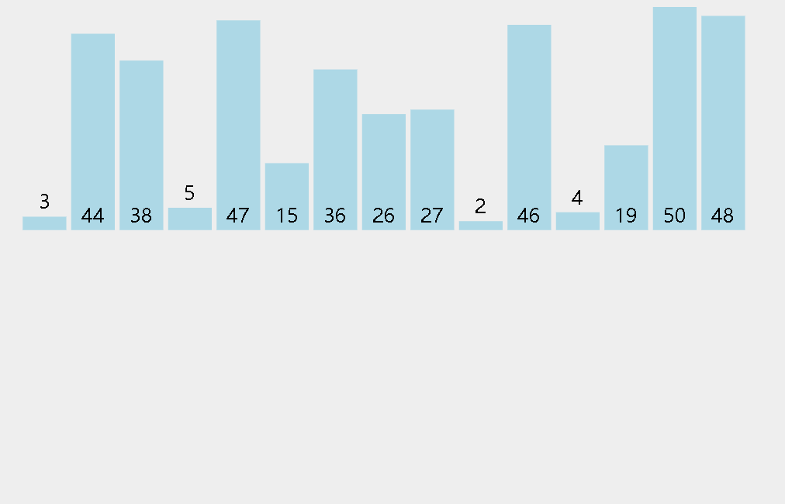
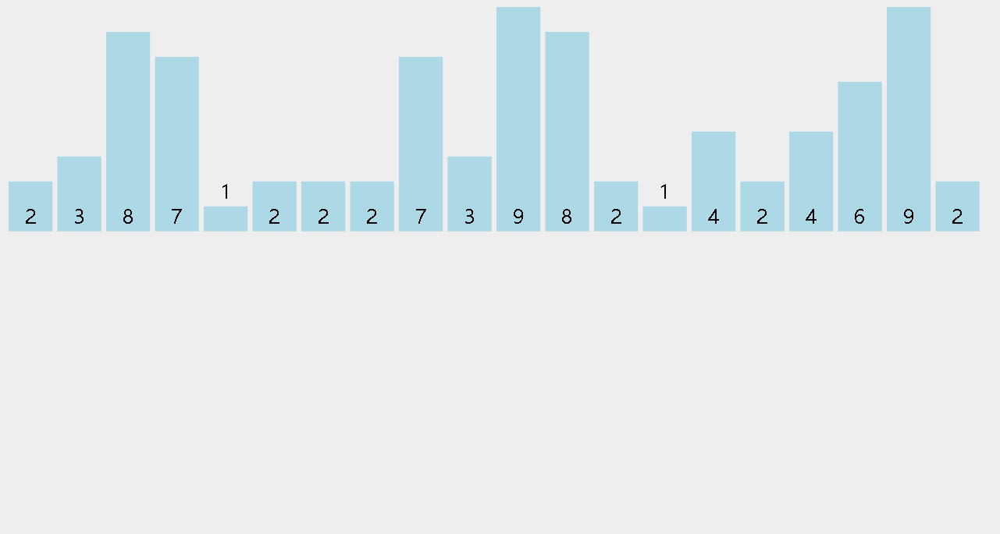

# 定义

所谓排序，就是按照一定的排序规则将一组待排序元素进行排列的过程。例如：2，1，4，3，5，按照从大到小排序是：5，4，3，2，1，按照从小到大排序是：1，2，3，4，5。

你会不会感觉这很简单啊？为什么要有那么多的排序算法呢？因为如果你要对一百万，一千万或者更多的元素排序，不同的排序算法的时间复杂度和空间复杂度都是不同的，我们要根据数据的特点，选择不同的排序算法。

接下来，我们把所有经典的排序算法都讲解一遍，相信你看完这篇文章在面试或者做题的过程中一定不再惧怕排序算法相关的题目，即使做不出来，也会有思路的。而且我会讲解对应的LeetCode经典例题，让你明白排序算法在 LeetCode 中的应用。最后，文章的最后分享一道LeetCode题目，可以让你测试所有的排序算法，这样就保证了排序算法的正确性。

备注:
1、接下来所有的算法都是按照**从小到大**进行排序的(从大到小是同理)。
2、数据量以ｎ作表示。
3、下面所有动图从 [https://visualgo.net/zh/sorting](https://visualgo.net/zh/sorting) 网站截取。
4、以下代码全部都是 C++ 书写,但是重要的是逻辑。

# 讲解

## 1.冒泡排序

如果让我说一个最容易理解的排序算法,我会认为是冒泡排序.
怎么简单呢?就是一个元素会看看后面的元素是不是比自己小,如果是那就交换位置,让小的在前面,如果你是小的,那么就不用交换位置了.而这个过程最多重复ｎ次就好了,因为即使最大的元素在最前面,经过ｎ次交换,也会达到它应该到的地方.
我们来看一个动图:


### 代码模板

相信你看了动态图片之后肯定就明白了冒泡排序的原理.
接下来我们看一下代码是怎么写的.

```cpp
 void bubblesort(vector<int>&nums)
 {
     int n = nums.size();
     for(int i = 0;i < n - 1;i++) {
         bool flag = true;
         for(int j = i + 1;j < n;j++) {
             if(nums[j] < nums[i]) {
                 swap(nums[i],nums[j]);
                 flag = false;
             }
         }
         if(flag) {
             return;
         }
     }
 }
```

冒泡排序的时间复杂度由于存在两个循环从1－ｎ。所以时间时间复杂度是O(n²)，没有用额外的空间，所以空间复杂度是O(1)。当然冒泡排序也有几种优化的算法,我们暂且不提。

## 2.选择排序

选择排序也是一个非常容易理解的算法,为什么容易理解呢?它其实就是每次从一组数据中找到最小的元素,然后与最前面的元素进行交换。
我们来看一个动图：


### 代码模板

相信你看了动态图片之后肯定就明白了选择排序的原理。
接下来我们看一下代码是怎么写的。

```cpp
void select(vector<int>&nums)
{
    int minnum = 0;
    for(int i = 0;i < nums.size();i++) {
        minnum = i;
        for(int j = i + 1;j < nums.size();j++) {
            if(nums[j] < nums[minnum]) {
                minnum = j;
            }
        }
        if(minnum != i) {
            swap(nums[i],nums[minnum]);
        }
    }
}
```

选择排序和冒泡排序时间复杂度和空间复杂度是一样的，时间复杂度是O(n²)，空间复杂度是O(1)。

## 3.插入排序

理解这个一定要根据动图来理解。简单来说，每个元素都会向前寻找它最合适的位置。
它的工作原理是通过构建有序序列，对于未排序数据，在已排序序列中从后向前扫描，找到相应位置并插入。
例如：对于1，3，2这个序列，从前往后看，1，3都不需要排列了，当算到2的时候，2是要插在3的前面的。


### 代码模板

结合动图，我们看下面的代码。如果实在不理解的话，你可以用插入排序手动排一个数组，相信你一定可以理解的。

```cpp
//插入排序
void insertsort(vector<int>&nums) {
    for(int i = 0;i < nums.size();i++)
    {
        int tem = nums[i];
        // 从当前元素i的的前一个开始比较
        int j = i - 1;
        while(j >= 0&& nums[j] > tem)
        {
            nums[j + 1] = nums[j];
            j--;
        }
        nums[j + 1] = tem;
    }
}
```

### 重点例题

LeetCode中[147. 对链表进行插入排序](https://leetcode-cn.com/problems/insertion-sort-list/)可以让你练习插入排序：

> 对链表进行插入排序。
>
> 插入排序的动画演示如上。从第一个元素开始，该链表可以被认为已经部分排序（用黑色表示）。
> 每次迭代时，从输入数据中移除一个元素（用红色表示），并原地将其插入到已排好序的链表中。

当然这个题目是需要一些对链表操作的技巧，不过重要的是思想，不是吗？除了对链表的操作之外，其他的和上面插入排序的模板几乎是相同的。

```c++
/**
 * Definition for singly-linked list.
 * struct ListNode {
 *     int val;
 *     ListNode *next;
 *     ListNode(int x) : val(x), next(NULL) {}
 * };
 */
class Solution {
public:
    ListNode* insertionSortList(ListNode* head) {
        ListNode* p = new ListNode(0);
        ListNode* tem;
        p -> next = head;
        while(head && head -> next)
        {
            if(head -> val < head -> next -> val)
            {
                head = head -> next;
                continue;
            }
            tem = p;
            while(tem -> next -> val < head -> next -> val)
            {
                tem = tem -> next;
            }
            ListNode * cur = head -> next;
            head -> next = cur -> next;
            cur -> next = tem -> next;
            tem -> next = cur;
        }
        return p -> next;
    }
};
```


## 4.快速排序

快速排序是我们平时用的最多的一种排序算法，主要采用了分而治之的思想。

快速排序使用分治法来把一个串分为两个子串。具体算法描述如下：

- 从数列中挑出一个元素，称为 “基准”；
- 重新排序数列，所有元素比基准值小的摆放在基准前面，所有元素比基准值大的摆在基准的后面（相同的数可以到任一边）。在这个分区退出之后，该基准就处于数列的中间位置。这个称为分区操作；
- 递归地把小于基准值元素的子数列和大于基准值元素的子数列排序。

如果上面的描述你比较晕，简单来说就是，在数组中随机挑取一个数字（不过，为了方便，一般我们会挑数组的第一个作为基准），比这个数小的放在左边，比这个数大的放在右边。然后对两边进行递归操作。

具体过程我们看动图，主要是理解快速排序的大致流程。


### 代码模板

```cpp
void quicksort(vector<int>& nums,int low,int hight) {
    if(low < hight) {
        int i = low,j = hight,tem = nums[low];
        while(i < j) {
            while(i < j && nums[j] >= tem) {
                j--;
            }
            while(i < j && nums[i] <= tem) {
                i++;
            }
            if(i < j) {
                swap(nums[i],nums[j]);
            }
        }
        nums[low] = nums[i];
        nums[i] = tem;
        quicksort(nums,low,i - 1);
        quicksort(nums,i + 1,hight);
    }
}
```

### 重点例题

在LeetCode [215. 数组中的第K个最大元素](https://leetcode-cn.com/problems/kth-largest-element-in-an-array/) 是一道非常经典的题目了，我们来看一下如何用快排的思想解决这个问题。

> 在未排序的数组中找到第 k 个最大的元素。请注意，你需要找的是数组排序后的第 k 个最大的元素，而不是第 k 个不同的元素。
>
> 示例 1:
>
> 输入: [3,2,1,5,6,4] 和 k = 2
> 输出: 5
> 示例 2:
>
> 输入: [3,2,3,1,2,4,5,5,6] 和 k = 4
> 输出: 4

这个题目是有很多解法的，但是利用快速排序的思想应该是最优的思路。最简单的做法是数组排序之后，从右向左数ｋ个数就好了，但是其实我们没有必要去排序所有的数，只需要找到从右到左第ｋ个数是什么就行了。这和快排的思想一致。


```c++
class Solution {
public:
    int findKthLargest(vector<int>& nums, int ans) {
        int left = 0;
        int size = nums.size();
        int right = size - 1;
        while(1)
        {
            int index = partiton(nums,left,right);
            if(index == size - ans)
            {
                return nums[index];
            }
            else if(index > size - ans)
            {
                right = index - 1;
            }
            else
            {
                left = index + 1;
            }
        }
        return -1;
    }
    int partiton(vector<int>&nums,int left,int right)
    {
        int privot = nums[left];
        int j = left;
        for(int i = left + 1;i <= right;i++)
        {
            if(nums[i] < privot)
            {
                j++;
                swap(nums[j],nums[i]);
            }
        }
        swap(nums[left],nums[j]);
        return j;
    }
};
```

## 5.堆排序

堆排序是指利用堆这种数据结构所设计的一种排序算法。堆排序主要分为两个过程，一个是建堆，另一个是排序。以建最大堆为例，每次把堆顶的元素取走，放到排序数组的最后一位。当堆顶元素被取走之后，最大堆会进行调整，把目前最大的元素调整到堆顶。依次循环。

我们可以看下面的动图：

建堆过程：


排序过程：


### 代码模板

结合上面的动图，我们应该可以比较容易的理解下面的代码。

```c++
//建最大堆过程
void buildHeap(vector<int>& nums,int root,int len) {
    int leftchild = 2 * root + 1;
    int rightchild = leftchild + 1;
    int index = root;
    if(leftchild < len && nums[index] < nums[leftchild]) {
        index = leftchild;
    }
    if(rightchild < len && nums[index] < nums[rightchild]) {
        index = rightchild;
    }
    if(index != root) {
        swap(nums[root],nums[index]);
        buildHeap(nums,index,len);
    }
}

void heapsort(vector<int>& nums,int size) {
    // 只需要动态调整非叶子节点就行了
    for (int i = size / 2; i >= 0; i--) {
        buildHeap(nums,i,size);
    }
    for (int i = size - 1; i >= 1; i--) {
        // 每次把堆顶的元素取走，再次进行排序
        swap(nums[i],nums[0]);
        buildHeap(nums,0,i);
    }
}
```

### 重点例题

我们来看LeetCode经典题目[295. 数据流的中位数](https://leetcode-cn.com/problems/find-median-from-data-stream/)

> 中位数是有序列表中间的数。如果列表长度是偶数，中位数则是中间两个数的平均值。
>
> 例如，
>
> [2,3,4] 的中位数是 3
>
> [2,3] 的中位数是 (2 + 3) / 2 = 2.5
>
> 设计一个支持以下两种操作的数据结构：
>
> void addNum(int num) - 从数据流中添加一个整数到数据结构中。
> double findMedian() - 返回目前所有元素的中位数。

首先声明一点，我们在平时做题的时候并不会真的手写堆排序的。因为C++已经帮我们封装好了，我们之间调用就行了。（相信其他语言也做到了）

题目要求我们得出数据流的中位数，我们可以维持一个最大堆 p 和一个最小堆 q。

如果数据总数是偶数，维持最小堆 q和最大堆 p的内部元素个数相等，则平均值是`(p.top() + q.top()) / 2.0`

如果数据总数是奇数，维持最小堆 q的内部元素比最大堆 p内部元素多一，则平均值是 `p.top()`

所以我们程序的主要任务就是动态调整最小堆 q和最大堆 p的元素数量。

比如:

```c++
 if(p.size() == q.size() + 2) {
     q.push(p.top());
     p.pop();
 }
```

最小堆 q的内部元素比最大堆 p内部元素多超过1了，所以就要动态调整。其他也是类似。

```c++
class MedianFinder {
public:
    /** initialize your data structure here. */
    priority_queue<int,vector<int>,less<int>> p;//最大堆
    priority_queue<int,vector<int>,greater<int>> q;//最小堆
    MedianFinder() {
        
    }
    
    void addNum(int num) {
        if(p.size() == 0 || num < p.top()) p.push(num);
        else q.push(num);
        if(p.size() == q.size() + 2) {
            q.push(p.top());
            p.pop();
        }
        if(p.size() == q.size() - 1) {
            p.push(q.top());
            q.pop();
        }
    }
    
    double findMedian() {
        if(p.size() == q.size()) {
            return (p.top() + q.top()) / 2.0;
        } 
        if(p.size() == q.size() + 1) {
            return p.top();
        } 
        return 0;
    }
};
```

## 6.归并排序

归并排序也是利用了分治的思想，将数组一直分割到只有一个元素为止，再两两进行合并，因为分割到最后，数组的元素只有一个时，一定是有序的，将两个有序的数组进行合并。所以我们的算法也是包括分割和合并两个过程的。

具体过程：

- 把长度为n的输入序列分成两个长度为n/2的子序列；
- 对这两个子序列分别采用归并排序；
- 将两个排序好的子序列合并成一个最终的排序序列。



### 代码模板

结合动图,我们来看下归并排序的代码:

```c++
void mergesort(vector<int>&nums,int begin,int end) {
        if(begin >= end) {
            return;
        }
        int mid = (begin + end) >> 1;
        mergesort(nums,begin,mid);
        mergesort(nums,mid + 1,end);
        mergesortInOrder(nums,begin,mid,end);
    }
void mergesortInOrder(vector<int>&arr,int bgn,int mid,int end) {
    int l = bgn;
    int m = mid + 1;
    int e = end;
    vector<int>arrs(end - bgn + 1);
    int k = 0;
    while(l <= mid && m <= e) {
        if(arr[l] < arr[m]) {
            arrs[k++] = arr[l++];
        }
        else {
            arrs[k++] = arr[m++];
        }
    }
    while(l <= mid) {
        arrs[k++] = arr[l++];
    }
    while(m <= end) {
        arrs[k++] = arr[m++];
    }
    for(int i = 0;i < arrs.size();i++) {
        arr[i + bgn] = arrs[i];
    }
}
```

### 重点例题

LeetCode经典题目:[面试题51. 数组中的逆序对](https://leetcode-cn.com/problems/shu-zu-zhong-de-ni-xu-dui-lcof/)

> 在数组中的两个数字，如果前面一个数字大于后面的数字，则这两个数字组成一个逆序对。输入一个数组，求出这个数组中的逆序对的总数。
>
> **示例 1:**
>
> **输入**: [7,5,6,4]
>
> **输出**: 5

这是一道LeetCode种hard 难度的题目，但是当你理解了归并排序后，这个题目也不过是在归并排序简单的增加逆序对数的计算而已。我把关键部分在代码中进行了注释。

```c++
class Solution {
public:
    int reversePairs(vector<int>& nums) {
        vector<int> copy(nums);
        int size = nums.size();
        if(size == 0 || size == 1) return 0;
        return help(nums,copy,0,size - 1);
    }
    int  help(vector<int>& nums,vector<int>& copy,int start,int end)
    {
        if(start == end)
        {
            copy[start] = nums[start];
            return 0;
        }
        int len = (end - start) / 2;
        int left = help(nums,copy,start,start + len);
        int right = help(nums,copy,start + len + 1,end);
        
        int i = start + len;
        int j = end;
        int index = end;

        int count = 0;

        while(i >= start && j >= start + len + 1)
        {
            if(nums[i] > nums[j])
            {
                copy[index--] = nums[i--];
                //对逆序对数量进行计算
                count += j - start - len;
            }
            else
            {
                copy[index--] = nums[j--];
            }
        }
        while(i >= start)
        {
            copy[index--] = nums[i--];
        }
        while(j >= start + len + 1)
        {
            copy[index--] = nums[j--];
        }
        
         //把copy后的数组 回到原数组
        for(int i = start; i <= end; i++) {
            nums[i] = copy[i];
        }
        return left + right + count;
    }
};
```

## 7.计数排序

这个有的书称它为桶排序，不过桶排序和计数排序还是不一样的。可以认为桶排序是计数排序的升级版。我们暂且不提。

计数排序也是非常容易理解的，不过这是一种空间换时间的思路。

- 找出待排序的数组中最大和最小的元素，开辟这么多的空间；
- 遍历每个元素，看其应该分配到那个位置上。
- 反向填充目标数组。

相信你看完动图一定可以的理解的。



### 代码模板

```c++
void countingSort(vector<int>&nums) {
    int maxnum = INT_MIN;
    int minnum = INT_MAX;
    for(int i = 0;i < nums.size();i++) {
        maxnum = max(nums[i],maxnum);
        minnum = min(nums[i],minnum);
    }
    vector<int>tem(maxnum - minnum + 1);
    for(auto num : nums) {
        tem[num - minnum]++;
    }
    int index = 0;
    for(int num = minnum;num <= maxnum;num++) {
        int cnt = tem[num - minnum];
        while(cnt-- > 0) {
            nums[index++] = num;
        }
    }
}
```

# 总结

我们理解了上面七种算法，对常见的排序类题目应该就有思路了，最后推荐一道LeetCode题目：[912. 排序数组](https://leetcode-cn.com/problems/sort-an-array/)

因为这个题目就是简单的让你排序而已，所以你可以通过这个题目测试自己写的代码对不对。不过如果是冒泡，选择，插入这几个时间复杂度比较高的算法最后几个测试用例过不去，不过通过前面的测试用例已经能检验算法的正确性了。

